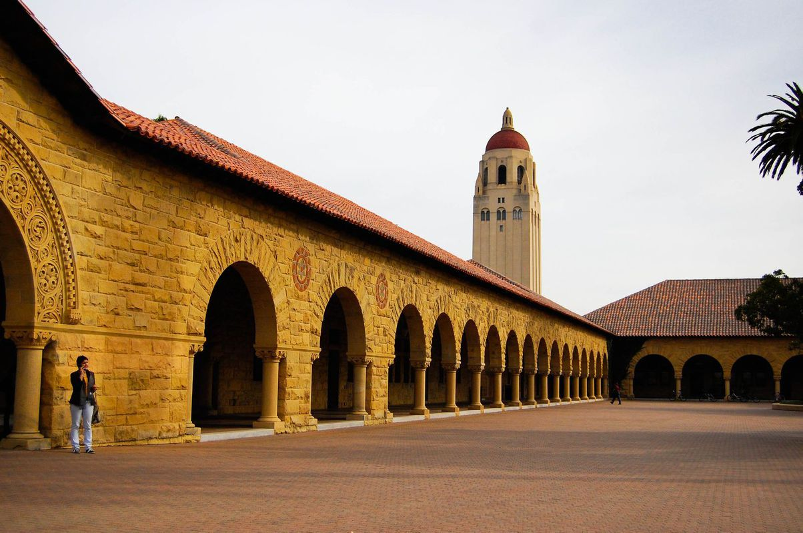
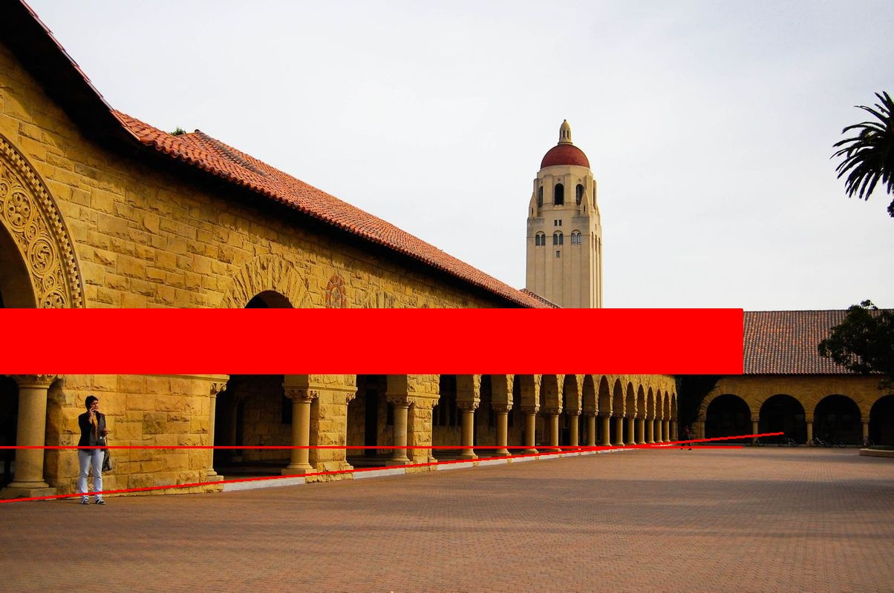

## 图像处理实验7
霍夫变换检测多条支线



code：
```python

# -*- coding=GBK -*-
import cv2 as cv
import numpy as np


# 霍夫直线检测
def line_image(image):
    gray = cv.cvtColor(image, cv.COLOR_BGR2GRAY)
    edges = cv.Canny(gray, 100, 150, apertureSize=3)
    lines = cv.HoughLines(edges, 0.5, np.pi / 180, 220)
    for line in lines:
        rho, theta = line[0]
        a = np.cos(theta)
        b = np.sin(theta)
        x0 = a * rho
        y0 = b * rho
        x1 = int(x0 + 1000 * (-b))
        y1 = int(y0 + 1000 * (a))
        x2 = int(x0 - 1000 * (-b))
        y2 = int(y0 - 1000 * (a))
        cv.line(image, (x1, y1), (x2, y2), (0, 0, 255), 2)
    cv.imwrite("3result.jpg", image)

path='E:\\PyProject\\txcl2\\3.jpg'
src = cv.imread(path)

cv.imshow("原来", src)
line_image(src)
cv.waitKey(0)
cv.destroyAllWindows()
```


github地址:
https://github.com/xkp793003821/txcl2