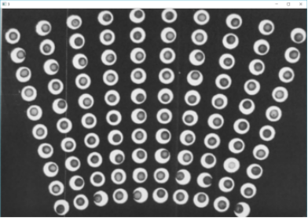
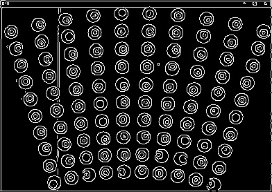
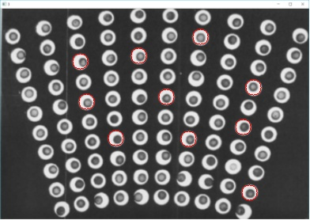

## 图像处理实验8

### 霍夫变换检测圆

原图



梯度图



检测结果图




code:
```python

# -*- coding: utf-8 -*-
import cv2


img = cv2.imread('E:\\PyProject\\txcl2\\5.png')
cv2.imshow('1', img)

result = cv2.blur(img, (5, 5))
cv2.imshow('2', result)

gray = cv2.cvtColor(result, cv2.COLOR_BGR2GRAY)
cv2.imshow('3', gray)


canny = cv2.Canny(img, 40, 80)
cv2.imwrite('5_dis.jpg', canny)


circles = cv2.HoughCircles(gray, cv2.HOUGH_GRADIENT, 1, 50, param1=80, param2=30, minRadius=10, maxRadius=20)

print(circles)


print(len(circles[0]))


for circle in circles[0]:

    print(circle[2])

    x = int(circle[0])
    y = int(circle[1])

    r = int(circle[2])

    img = cv2.circle(img, (x, y), r, (0, 0, 255), 1, 8, 0)

cv2.imwrite('5_circle.jpg', img)


cv2.waitKey(0)
cv2.destroyAllWindows()

```
github地址:
https://github.com/xkp793003821/txcl2