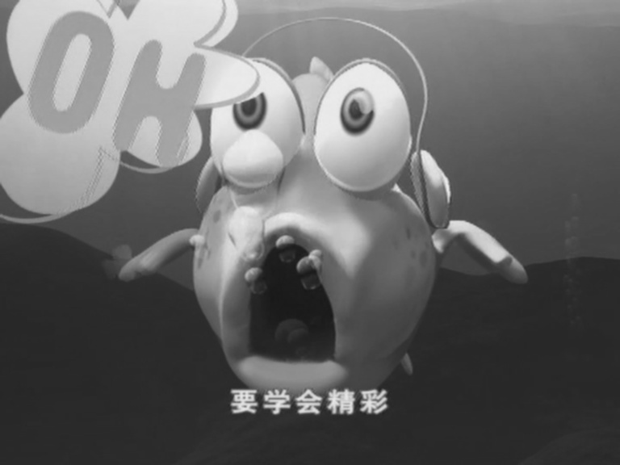
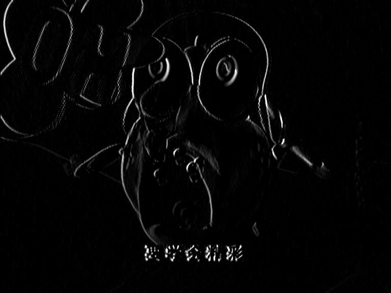
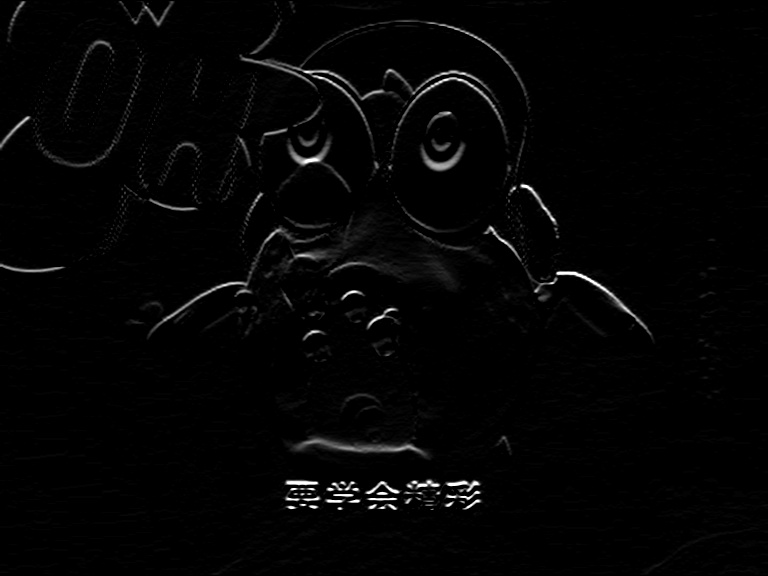
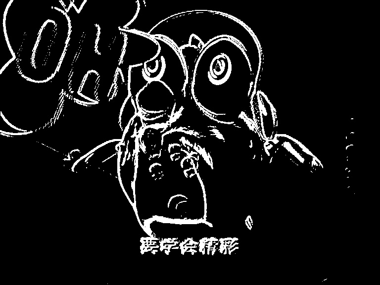

## 图像处理实验5
### 定义两个索贝尔滤波核形如 
```python
x_kernel=np.array([[-1,0,1],
                   [-2,0,2],
                   [-1,0,1]])
                   
y_kernel=np.array([[-1,-2,-1],
                   [0,0,0],
                   [1,2,1]])
```

                   
再分别进行卷积，计算出x方向以及y方向上的梯度
最终梯度值使用平方和完成计算。

原图


x方向梯度图


y方向梯度图


最终梯度阈值分割图


dis=ximage*ximage+yimage*yimage

dis=np.sqrt(dis)


从而计算出图像内任意一点的梯度值大小

完整代码如下
 ```python
import cv2
import numpy as np
from scipy import ndimage

path='E:\\PyProject\\txcl2\\1.png'

image=cv2.imread(path)

image=cv2.GaussianBlur(image,(3,3),0)

grayimage=cv2.cvtColor(image,cv2.COLOR_BGR2GRAY)

x_kernel=np.array([[-1,0,1],
                   [-2,0,2],
                   [-1,0,1]])
y_kernel=np.array([[-1,-2,-1],
                   [0,0,0],
                   [1,2,1]])

ximage=cv2.filter2D(grayimage,ddepth=-1,kernel=x_kernel)
yimage=cv2.filter2D(grayimage,ddepth=-1,kernel=y_kernel)


cv2.imwrite('1x_dis.jpg',ximage)
cv2.imwrite('1y_dis.jpg',yimage)
ximage=np.array(ximage,np.int)
yimage=np.array(yimage,np.int)
dis=ximage*ximage+yimage*yimage
dis=np.sqrt(dis)
print(dis.shape)


th=20
dis=dis>th
can=np.array(dis*255,np.uint8)
cv2.imwrite('1can.jpg',can)
cv2.imwrite('1image.jpg',grayimage)
cv2.waitKey(0)
```

github地址:
https://github.com/xkp793003821/txcl2
