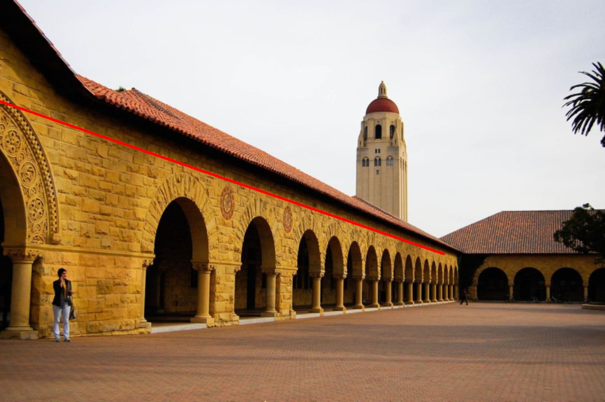

## 图像处理实验6
### 霍夫变换基础

 ​霍夫变换是一个特征提取技术。其可用于隔离图像中特定形状的特征的技术，应用在图像分析、计算机视觉和数字图像处理领域。目的是通过投票程序在特定类型的形状内找到对象的不完美实例。这个投票程序是在一个参数空间中进行的，在这个参数空间中，候选对象被当作所谓的累加器空间中的局部最大值来获得，所述累加器空间由用于计算霍夫变换的算法明确地构建。最基本的霍夫变换是从黑白图像中检测直线(线段)。Hough变换主要优点是能容忍特征边界描述中的间隙，并且相对不受图像噪声的影响。

霍夫变换检测图像中一条直线



code
```python
import cv2
import numpy as np
from scipy import ndimage

path='E:\\PyProject\\txcl2\\3.jpg'

image=cv2.imread(path)

image=cv2.GaussianBlur(image,(3,3),0)

grayimage=cv2.cvtColor(image,cv2.COLOR_BGR2GRAY)

x_kernel=np.array([[-1,0,1],
                   [-2,0,2],
                   [-1,0,1]])
y_kernel=np.array([[-1,-2,-1],
                   [0,0,0],
                   [1,2,1]])
cv2.imshow('oriimage',image)
ximage=cv2.filter2D(grayimage,ddepth=-1,kernel=x_kernel)
yimage=cv2.filter2D(grayimage,ddepth=-1,kernel=y_kernel)

cv2.imshow('x_dis',ximage)
cv2.imshow('y_dis',yimage)
ximage=np.array(ximage,np.int)
yimage=np.array(yimage,np.int)
dis=ximage*ximage+yimage*yimage
dis=np.sqrt(dis)
print(dis.shape)


th=30
dis=dis>th
edges=np.array(dis*255,np.uint8)
lines = cv2.HoughLines(edges, 10, np.pi / 180, 20)  
result = np.zeros((image.shape[0],image.shape[1]))
for r, theta in lines[0]:
    # Stores the value of cos(theta) in a
    a = np.cos(theta)

    # Stores the value of sin(theta) in b
    b = np.sin(theta)

    # x0 stores the value rcos(theta)
    x0 = a * r

    # y0 stores the value rsin(theta)
    y0 = b * r

    # x1 stores the rounded off value of (rcos(theta)-1000sin(theta))
    x1 = int(x0 + 1000 * (-b))

    # y1 stores the rounded off value of (rsin(theta)+1000cos(theta))
    y1 = int(y0 + 1000 * (a))

    # x2 stores the rounded off value of (rcos(theta)+1000sin(theta))
    x2 = int(x0 - 1000 * (-b))

    # y2 stores the rounded off value of (rsin(theta)-1000cos(theta))
    y2 = int(y0 - 1000 * (a))

    # cv2.line draws a line in img from the point(x1,y1) to (x2,y2).
    # (0,0,255) denotes the colour of the line to be
    # drawn. In this case, it is red.
    cv2.line(image, (x1, y1), (x2, y2), (0, 0, 255), 3)

# All the changes made in the input image are finally
# written on a new image houghlines.jpg
cv2.imshow('houghlines3.jpg', image)
cv2.imwrite('houghlines3.jpg', image)
cv2.imwrite('edges.jpg',edges)
cv2.imwrite('x_dis.jpg',ximage)
cv2.imwrite('y_dis.jpg',yimage)
cv2.waitKey(0)


```

github地址:
https://github.com/xkp793003821/txcl2